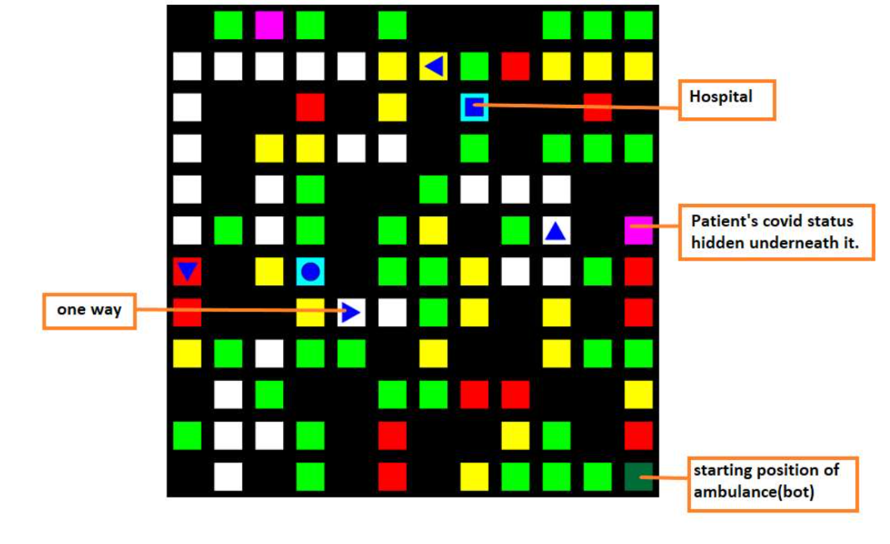
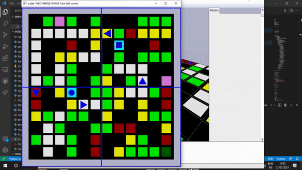
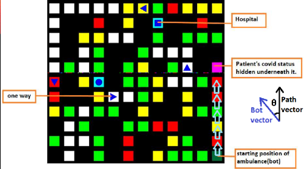
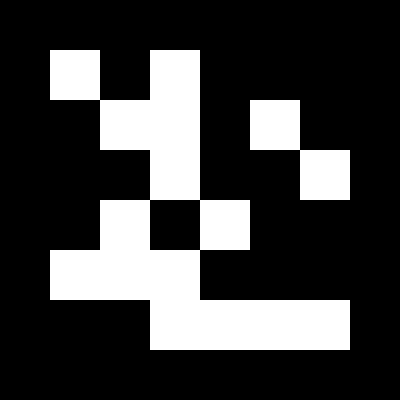
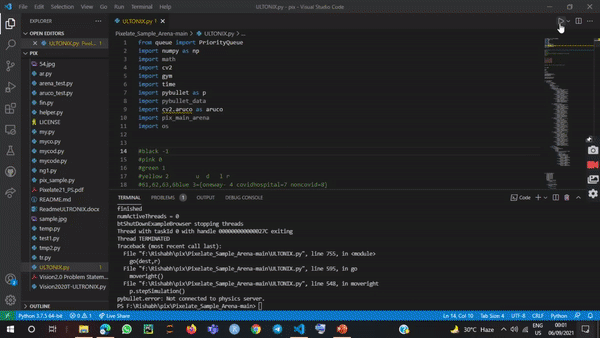

# Pixelate-21-Technex-IIT-BHU

For better understanding, read the problem statement pdf file given above.

### Interpretation of Problem statement

This whole problem statement can be interpreted as the problem of the weighted directed graph. The different squares can be viewed as the different nodes of the graph. The constraints like traffic levels of a particular node can be viewed as the cost while traversing it. In order to take the patient to its respective hospital in least time, we can use Dijkstra shortest path algorithm, which gives the shortest path between patient to hospital with the least possible cost. We interpretate cost as different constraints like one way path, high traffic, low traffic region and so on.

### So how to prepare Graph ?

Luckily, we have image processing techniques to simplify our task. Here, we used image processing techniques to prepare colour matrix, since different nodes in the arena are represented by different colours. Using ROI function of opencv we cropped single nodes from the graph and using rgb values of the image, we get to know about the colour of the node. So, here is how we are doing it.

Beginning with importing important modules like cv2, pybullet, gym, numpy etc. we initialize an empty list for storing the co-ordinates of the patients node. Since, there were only two type of hospitals i.e., covid and non-covid hospital, we initialize their respective position as (-1,-1) . Then, we started our pybullet simulation environment. We remove the bot from the arena in order to prepare the colour matrix of the arena. The colour matix represents different types of nodes present within the arena like node with high traffic, low traffic, moderate traffic, one way detection, hospital & pateint localization and so on along with localising the position of patient and hospital and stored the co-ordinates of their node. So that we can differentiate among different nodes. This is implemented by using function colourmatrix(). Now we have all of the functions ready to create graph, so let’s make it using costmatrix() which precisely represents the connectivity between the edges and weight of the individual nodes. We use adjacency list for representing connectivity between the nodes to avoid heavy computational expenses.

Once the colour matrix is ready, we’ll use it to create our cost matrix which is nothing but the weights or the cost while traversing a particular node using function costmatrix(). In the cost matrix, we have the costs of hospital node and patient node as 500 and the nodes where no connectivity is present, i.e., black node as INF. The cost of nodes with no traffic(white) as 0, low traffic(green) as 1, moderate traffic(yellow) as 2 and high traffic as 3. We will use this matrix for making the graph while taking care of one ways also.

### Movement of Bot

 

Using aruco  marker, function detectMarker will return us the corners of the bot, using these corners we calculate the position vector of the bot. And the path vector we have already new because of Dijkstra shortest path Algorithm. Thus, we find the angle between these two vectors, our aim is to move the bot in the direction of position vector. The threshold angle, we use were 7.2 degree.

     Aruco marker

Now, our graph is prepared. We used Dijkstra shortest path algorithm for calculating the shortest path between starting point to hospital to patient and so on. This algorithm runs only 4 times. From starting point to first patient, first patient to hospital, hospital to second patient and second patient to the hospital. For making a step from one node to other node we are using functions like posdetect() which detects the current position of the bot using aruco marker code and returns it’s co-ordinates. Using these co-ordinates, we got to know the direction in which bot is pointing i.e., it’s position vector. We have another vector directvector which represents the direction in which the bot has to move and which changes from node to node following Dijkstra shortest path.
Using these two vectors, in the movement() function, we found the angle between them and according to that angle, we instructed the bot to move in a particular direction like left, right, forward direction. We also kept the track of the distance between the current node and the final destination node using dist() function because we have to stop one node earlier to the patient and hospital.
While reaching one node before the location of the patient, we need to know whether the patient is covid type or non covid type in order to bring it to it’s respective hospital. And we used getPatient() function, we uncovers the cover plate of the patient and find it’s status. Once we got to know the type of patient we have, we will then bring him to it’s respective hospital. And we’ll repeat the same procedure for next patient.

### Glimpse of the project

