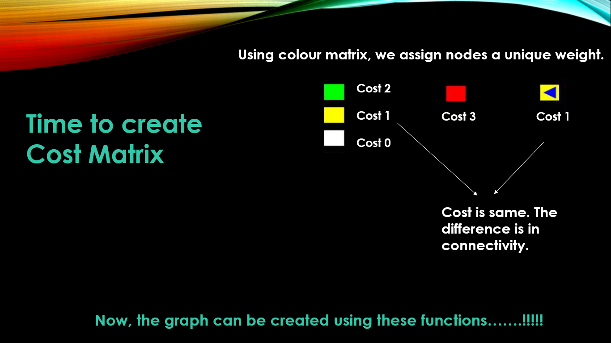

# Pixelate-21-Technex-IIT-BHU

For better understanding, read the problem statement pdf file given above.

### Interpretation of Problem statement

This whole problem statement can be interpreted as the problem of the weighted directed graph. The different squares can be viewed as the different nodes of the graph. The constraints like traffic levels of a particular node can be viewed as the cost while traversing it. In order to take the patient to its respective hospital in least time, we can use Dijkstra shortest path algorithm, which gives the shortest path between patient to hospital with the least possible cost. We interpretate cost as different constraints like one way path, high traffic, low traffic region and so on.

### So how to prepare Graph ?

Luckily, we have image processing techniques to simplify our task. Here, we used image processing techniques to prepare colour matrix, since different nodes in the arena are represented by different colours. Using ROI function of opencv we cropped single nodes from the graph and using rgb values of the image, we get to know about the colour of the node. 

